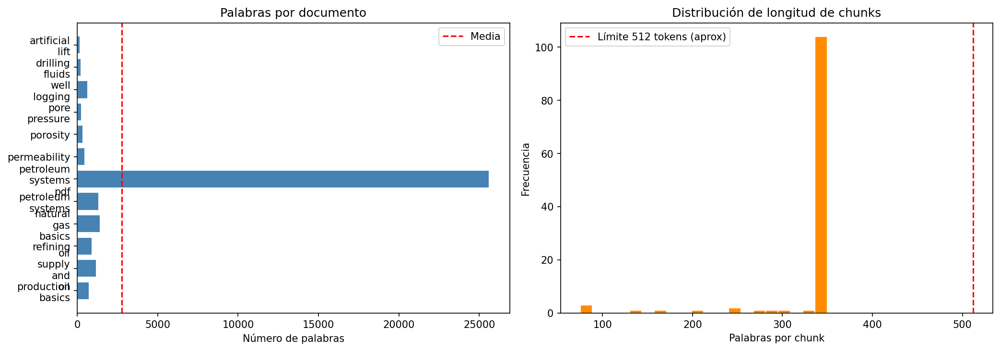
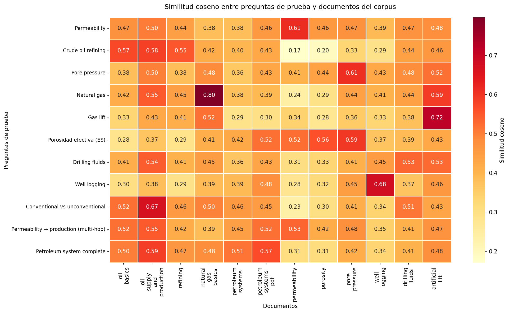

# RAG Aplicado a Ingeniería de Petróleos

Sistema de Retrieval-Augmented Generation que responde preguntas técnicas sobre
ingeniería de petróleos a partir de fuentes públicas (EIA, USGS, SLB).

Desarrollado como taller final del curso Procesamiento de Lenguaje Natural.

**Integrantes:** Maria Camila Peñaloza — Miguel Casteblanco — Anthony D'Croz

---

## Estructura del proyecto

```
.
├── data/
│   ├── petroleum_corpus/
│   │   ├── clean/
│   │   │   ├── chunks.jsonl        # chunks listos para indexar
│   │   │   └── documents.jsonl     # documentos del corpus
│   │   ├── raw/                    # HTMLs y PDFs descargados
│   │   └── corpus_report.md        # estadísticas del corpus
│   └── sources/
│       ├── petroleum_corpus_sources.json   # URLs fuente
│       └── rag_test_questions.json         # 11 preguntas de evaluación
├── figures/
│   └── corpus_stats.png
├── scripts/
│   └── build_petroleum_corpus.py   # descargador, extractor y chunker
├── main_taller.ipynb
├── pyproject.toml
└── README_petroleum_rag.md
```

## Corpus

| Métrica | Valor |
|---|---|
| Documentos | 12 |
| Chunks | 116 |
| Palabras totales | 33 304 |
| Fuentes | EIA, USGS, SLB Energy Glossary |

Temas cubiertos: `artificial_lift`, `drilling_fluids`, `natural_gas_basics`,
`oil_basics`, `oil_supply_and_production`, `permeability`, `petroleum_systems_pdf`,
`pore_pressure`, `porosity`, `refining`, `well_logging`.

> **Nota:** el topic `petroleum_systems_pdf` corresponde al documento USGS PDF.
> Las preguntas de prueba deben usar este key exacto en `tema_esperado`.

`petroleum_systems_pdf` es la temática más recurrente. 




## Análisis del mapa de calor — Similitud coseno preguntas × documentos

El rango general del mapa es 0.17–0.80, con la mayoría de valores
concentrados entre 0.38–0.55. Esta densidad en la zona media refleja
que todos los documentos comparten vocabulario base del dominio
petrolero, lo que limita la capacidad del embedder para discriminar
entre temas.



### Casos exitosos
| Pregunta | Documento esperado | Similitud |
|---|---|---|
| Natural gas | natural_gas_basics | **0.80** |
| Gas lift | artificial_lift | **0.72** |
| Well logging | well_logging | **0.68** |
| Pore pressure | pore_pressure | **0.61** |
| Permeability | permeability | **0.61** |

Preguntas con vocabulario técnico específico y sin ambigüedad léxica
producen las similitudes más altas y el retrieval más preciso.

### Casos problemáticos
- **Crude oil refining** activa oil_basics (0.57) y oil_supply_and_production
(0.58) con mayor fuerza que refining (0.55). El retriever prefiere
documentos generales sobre petróleo al específico de refinación.
- **Permeability → production (multi-hop)** alcanza solo 0.41 con
permeability. La pregunta relacional diluye la señal — "production"
domina el embedding y atrae oil_supply_and_production (0.52).
- **Porosidad efectiva (ES)** presenta la fila más plana del mapa
(0.28–0.59). La pregunta en español genera un embedding menos focalizado,
distribuyendo similitud entre pore_pressure, porosity y petroleum_systems_pdf.

### Correlaciones entre temas
pore_pressure y porosity comparten puntuaciones similares en múltiples
preguntas (diferencia < 0.06), lo que explica la confusión del retriever
en el Caso 6. Ambos temas describen espacios porosos y fluidos en roca
reservorio — vocabulario casi idéntico a nivel de embedding.

### Limitante identificada
El modelo `paraphrase-multilingual-mpnet-base-v2` es de propósito general.
En un corpus de dominio específico como E&P, los embeddings no discriminan
suficientemente entre temas relacionados. Un modelo fine-tuned en literatura
técnica petrolera (SPE papers, manuales de perforación) produciría diagonales
más pronunciadas y mejoraría el Recall@1 por encima del 54.55% actual.

## Modelos

| Rol | Modelo | Arquitectura | Parámetros |
|---|---|---|---|
| Embeddings | `paraphrase-multilingual-mpnet-base-v2` | Encoder-only (MPNet) | ~278 M |
| Generación | `google/flan-t5-base` | Encoder-Decoder | 250 M |

Ningún modelo requiere entrenamiento — ambos se usan directamente en inferencia.
El conocimiento del sistema entra por el corpus, no por los pesos del modelo.

Los vectores se normalizan y el índice FAISS usa `IndexFlatIP`
(producto interno = similitud coseno con vectores normalizados).

## Instalación

Requiere Python 3.10+. Instalar PyTorch CPU antes de las demás dependencias:

```bash
pip install torch --index-url https://download.pytorch.org/whl/cpu
pip install -e .
```

Registrar el kernel para Jupyter:

```bash
python -m ipykernel install --user --name=petroleum-rag
```

Luego en el notebook seleccionar **Kernel → petroleum-rag**.

## Construcción del corpus

```bash
python scripts/build_petroleum_corpus.py --delay-seconds 0.5
```

Los archivos se escriben en `data/petroleum_corpus/clean/`.

## Carga en el notebook

El notebook lee los archivos por path relativo — no requiere subida manual:

```python
from pathlib import Path
import pandas as pd

CORPUS_DIR = Path("data/petroleum_corpus/clean")

docs   = pd.read_json(CORPUS_DIR / "documents.jsonl", lines=True)
chunks = pd.read_json(CORPUS_DIR / "chunks.jsonl",    lines=True)
```

Las preguntas de prueba se cargan con:

```python
import json

with open("data/sources/rag_test_questions.json") as f:
    preguntas_prueba = json.load(f)
```

## Evaluación

La métrica principal es **Recall@k** con criterio de tema: un hit se registra
cuando el topic esperado aparece entre los top-k chunks recuperados.

| k | Recall@k | Hits |
|---|---|---|
| 1 | 63.64% | 7/11 |
| 3 | 90.91% | 10/11 |
| 5 | 90.91% | 10/11 |

Las 11 preguntas de prueba cubren los 11 temas del corpus e incluyen
una pregunta en español y una pregunta imposible (fuera del corpus).

Los dos casos fallidos a k=3 corresponden a una pregunta multi-hop
(`permeability → production rates`) y una inconsistencia de nomenclatura
de topic key (`petroleum_systems` vs `petroleum_systems_pdf`).